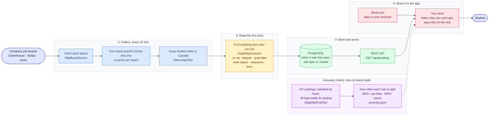

# Internship Radar

[](https://github.com/abakarkosso/internship-radar/actions/workflows/ci.yml)

Canadian tech internships as soon as they're posted, filtered to the ones you can actually get.

There are two easy ways to waste an internship search: applying a week after the first batch of applicants
was already reviewed, and applying to roles you were never eligible for. Internship Radar checks company job
boards every 15 minutes and reads each posting for the parts that decide eligibility: co-op required, grad
students only, must return to school, graduation window and term length.

## What's different about it

Plenty of tools list internships. I wanted one that answers "can I actually get this one?" You tell it your
graduation date, whether you're in co-op, your degree and your work status. It hides the roles that rule you
out and tells you why for the rest.

I hand-labelled real postings to check every rule, and the numbers are in the app under "How accurate is
this?". A rule is only allowed to hide a posting after it was right 90% of the time or better on postings I
kept aside and never tuned against. The ones that aren't there yet just show a note instead. The reasoning
is in [DECISIONS.md](DECISIONS.md).

| Rule | Held-out precision (2026-10-02) | Used to |
|---|---|---|
| Requires a co-op program | 100% (7 of 7) | Hide |
| Citizenship or sponsorship limits | 100% (4 of 4) | Hide |
| Security clearance or Controlled Goods | 100% (5 of 5) | Show |
| Must return to school after | 100% (1 of 1) | Show |
| Graduation date window | 86% (6 of 7) | Warn |
| Master's/PhD only | not enough held-out postings yet | Show |

## What it does

- Polls public Greenhouse, Ashby and Lever job boards on a schedule and keeps only student roles located in Canada.
- Extracts eligibility rules and requested skills from each description with tested, rule-based patterns.
- Tracks when each posting was first seen and closes postings that disappear from their board.
- Serves a fast, filterable feed with an "About you" profile kept only in the browser, plus search and role type.

## Stack

| Layer | Choice |
|---|---|
| API and ingestion | Java 21, Spring Boot 4, Spring Data JPA |
| Database | PostgreSQL 17, schema managed by Flyway |
| Front end | React 19, TypeScript, Vite |
| Tests | JUnit 5, Testcontainers (real PostgreSQL), Vitest |
| Delivery | Docker (single image), GitHub Actions CI |

## Architecture

Read it left to right. That's the trip a posting takes from a company's job board to your screen.
The purple box is the part I care about most: a rule only gets to hide postings from you once it has
proven itself on postings I labelled by hand.



Each board is handled on its own. New postings are saved with the time they were first seen, existing
ones are updated, and ones that disappear from the board are marked closed. If a board is down, its
postings are left alone instead of being closed by mistake.

## Run it locally

Requirements: Java 21, Node 24, Docker.

```bash
docker compose up -d db                  # PostgreSQL on localhost:5433
cd backend && ./mvnw spring-boot:run     # API on :8080, starts ingesting after 10 seconds
cd frontend && npm install && npm run dev   # UI on :5173, proxies /api to :8080
```

Or run the production image: `docker compose --profile full up --build`, then open http://localhost:8080.

## Tests

```bash
cd backend && ./mvnw verify    # unit tests plus Testcontainers integration tests (needs Docker)
cd frontend && npm test
```

Eligibility rules are tested against wording quoted from real postings, so a change that breaks
"applicants do not need to be in a registered co-op program" fails the build. `EligibilityEvalTest`
is the accuracy gate. After changing a rule, regenerate the published numbers with
`./mvnw test -Dtest=EligibilityEvalTest -DupdateAccuracy=true`.

## API

`GET /api/postings` takes `q`, `category` (`SOFTWARE`, `DATA`, `AI_ML`, `QUANT`, `PRODUCT`,
`HARDWARE`, `OTHER`), `excludeCoopRequired`, `excludeGraduateOnly`, `workStatus` (`CITIZEN_OR_PR`,
`WORK_PERMIT`, `NEEDS_SPONSORSHIP`), `page`, `size` (max 100). Results are sorted newest first. Each
posting carries its extracted rules: `coopRequirement`, `graduateDegreeRequired`, `mustReturnToSchool`,
`gradEarliest`/`gradLatest` (`YYYY-MM`, either may be null), `workAuthorization`, `termMonths`, `skills`.

`GET /api/postings/stats` returns the open posting count, company count, and when the boards were
last checked. Errors use RFC 9457 problem details. The API is rate limited to 120 requests per
minute per client.

## Configuration

| Variable | Default | Purpose |
|---|---|---|
| `DATABASE_URL` | `jdbc:postgresql://localhost:5433/radar` | JDBC URL |
| `DATABASE_USER` / `DATABASE_PASSWORD` | `radar` / `radar` | Database credentials |
| `PORT` | `8080` | HTTP port |
| `SPRING_PROFILES_ACTIVE` | unset (`prod` in the image) | `prod` turns on JSON logs and trusts the platform's forwarded headers |
| `FORWARD_HEADERS_STRATEGY` | `none` (`native` under `prod`) | `native` trusts X-Forwarded-For only from private-network proxies. Set `none` if nothing sits in front of the app |

Boards to track are listed under `radar.sources` in `backend/src/main/resources/application.yml`.

### Adding a company

Find the company's careers page. If it's hosted on Greenhouse (`boards.greenhouse.io/<board>`), Ashby
(`jobs.ashbyhq.com/<board>`) or Lever (`jobs.lever.co/<board>`), add the `<board>` part under the matching
provider:

```yaml
ashby:
  - { board: wealthsimple, company: Wealthsimple }
```

Check it responds before committing, e.g. `curl -s https://api.ashbyhq.com/posting-api/job-board/<board> | head`.
On the next ingestion cycle the log shows `Ingested ashby:<board>: fetched=… kept=…`.

Design notes and trade-offs are in [DECISIONS.md](DECISIONS.md).
